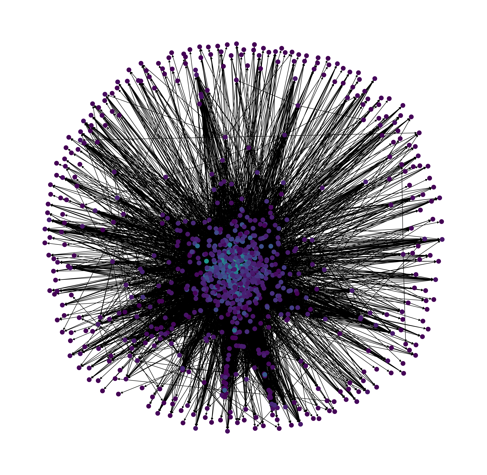
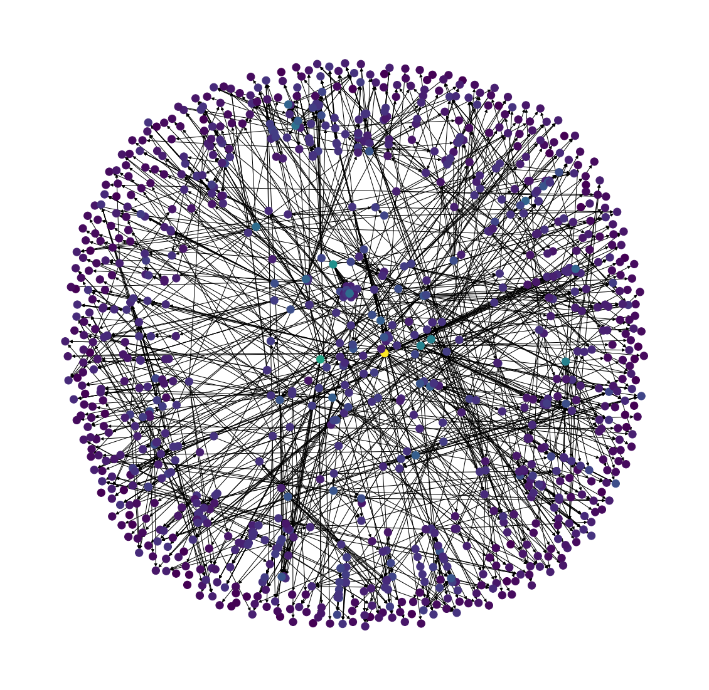

# Discrete-Math-Final-Project
---

**Link to Presentation**: [Here](https://docs.google.com/presentation/d/1uqC-Qx4atb-EpN-K5tSreMO5Cp9bhCh1xRemJBxIhJU/edit?usp=sharing)

## Dependencies
To run the code in this repository, install jupyter notebook and Python 3 in your environment. A list of the packages needed for different scripts is included in the requirements.txt document.

## Data
The data for this project comes from Stanford's Network Analysis Project (SNAP). The first data set we used is the [Amazon Copurchases Dataset](https://snap.stanford.edu/data/amazon-meta.html), which has Amazon products (primarily books) as the nodes, and co-purchases (products bought at the same time) as the edges. This dataset includes a list of co-purchases based on their ASIN ID number, and [meta data ](https://snap.stanford.edu/data/amazon-meta.html), which has the product information for all the products involved. The second data set we used is the [email-EU-core network](https://snap.stanford.edu/data/email-Eu-core.html), which was generated from email data of a large European research institution. The dataset includes incoming and outgoing emails between members of the research institution and excludes outgoing and incoming messages to the rest of the world. Each node is a person, represented by an ID number, and there is an edge (u, v) in the network if person u sent person v at least one email. 

## Parsing Data
To access the data from these datasets, we created scripts for parsing the network information into dictionary data structures, where each key is a node, and all edges are listed as the values of that node. The networks were both **undirected graphs**, so the connections were listed both ways. These data structures were then stored in pickle files to speed up access for future use.  
`parse_names.py`: Parses the Amazon network along with its metadata labels.  
`parse_emails.py`: Parses the EU-core-network email data.  
`parse_departments.py`: Parses the EU-core-network departments for each person.  

## Bron-Kerbosch Algorithm
In the Jupyter notebooks in this repository labeled with "Bron-Kerbosch", you can run our implementation of the Bron-Kerbosch algorithm, using recursive backtracking. The notebooks display information on algorithm run-time, the number of recursive calls, identified maximal and maximum cliques, mapped names of what the clique items are, and visualizations of department breakdown for the email network. The notebooks are labeled by dataset and include implementations of the BK algorithm naively and with pivoting. Pivoting increases the efficiency of the Bron-Kerbosch algorithm when there are many non-maximal cliques and involves picking a pivot vertex, u, from a set of candidates, P. Any maximal clique must include u or one of its non-neighbors, which decreases the total number of recursive calls. For the email dataset, we discovered that the pivot method was significantly faster than the naive method, taking 29.36 ms for the pivot method, and 202.46 ms for the naive method. This is almost a factor of 10! Pivoting was slower than the naive method in the Amazon dataset because the network is less dense. 

The archive folder contains older versions of the Jupyter notebooks, including an implementation of Bron-Kerbosch with degeneracy ordering. Degeneracy ordering is the ordering of vertices such that each vertex has d or fewer neighbors that come later in the ordering. It can increase the efficiency of the Bron-Kerbosch algorithm by determining an ordering of recursive calls that carefully minimizes the size of P. However, the time it takes to find the degeneracy ordering for very large networks is exceedingly long, so we were not able to test out our implementation of degeneracy ordering on our Amazon or email data. 

## Visualization
We used Python's `NetworkX` library for all of our network visualizations. Lighter colors correspond to nodes with more connections or higher degree. 

### Email Network

### Amazon Network
For the Amazon co-purchasing dataset, we visualized the first 1000 nodes to allow for better comparisons with the email network.

